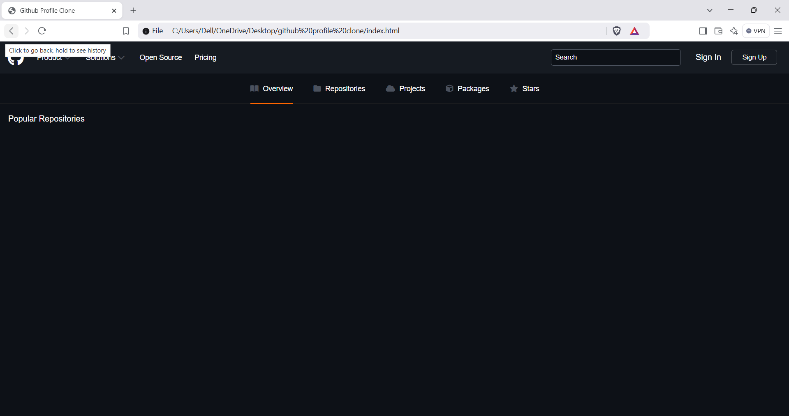

# 👤 GitHub Profile Clone

A sleek and functional clone of the GitHub profile interface built using **HTML**, **CSS**, and **JavaScript**. This web app fetches real-time data from the GitHub API and displays user profile details, including repositories, followers, company, location, and more — styled with GitHub’s look and feel.

---

## 🚀 Features

- 🔎 Search for any GitHub username
- 🧑‍💼 Displays user profile information (avatar, bio, company, location, etc.)
- 📦 Lists subscribed repositories with language, stars, and fork count
- 🎨 Fully responsive layout with GitHub-like theme

---

## 🛠️ Tech Stack

- **HTML**
- **CSS**
- **JavaScript (Fetch API)**
- **GitHub API**

---

2. Open index.html in your browser

That’s it! No build tools or dependencies needed.

---

🖼️ Project Structure

📁 github-profile-clone
├── index.html
├── style.css
├── app.js
├── output.png.png

---

